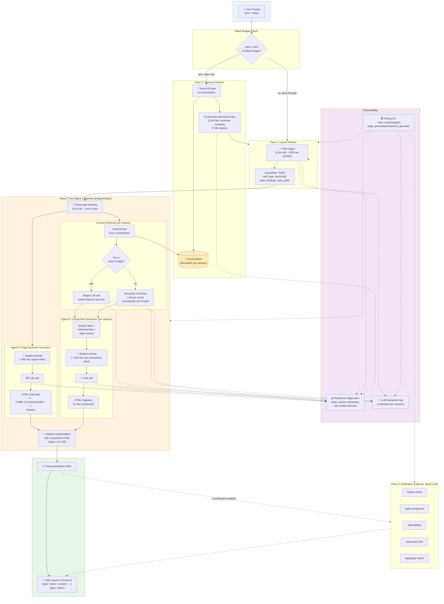

# Agentic UI Generation — Architecture Overview

## Full Pipeline



## LLM Call Breakdown

| # | Step | Agent | Tokens (sys+usr) | Output | Thinking |
|---|------|-------|------------------|--------|----------|
| 0 | Summarize (if needed) | Indexer | ~1,200 + content | ~200-500 tok structural index | Disabled |
| 1 | Plan | Layout Planner | ~1,200 + query | JSON (card_type, sections, etc.) | Disabled |
| 2 | Page Shell | Agent A | ~800 + plan JSON | HTML with placeholders | Disabled |
| 3-N | Per Component | Agent B | ~1,200 + data+style | HTML fragment | Disabled |
| * | Per Section Retrieval | Content Retriever | ~200 + context | Raw text (field: value list) | Disabled |
| * | Verification (opt) | Cloud LLM | Full original prompts | Pass/fail report | N/A |

## Thinking Mode Control

```
thinking_enabled=True  →  reasoning: {"effort": "low/medium/high"}  →  <think> tags or reasoning field
thinking_enabled=False →  reasoning: {"effort": "none"}             →  no reasoning, direct output
```

**Default**: All local LLM calls disable reasoning (`thinking_enabled=False`) to avoid burning output tokens on
`<think>` blocks. Cloud LLM calls keep the default (`True`).


**/no_think injection (Qwen3)**: when thinking is disabled and the model is Qwen3, `LlmClient._apply_no_think` prepends `/no_think` to the system prompt (gated by `NO_THINK_ENABLED`, text via `NO_THINK_DIRECTIVE` env vars; Qwen3 detected from `LOCAL_LLM_MODEL`). Any reasoning block that leaks through despite the directive is stripped by `_strip_thinking_measured`, which also tallies the wasted thinking tokens, exposed via the `last_thinking_tokens` property and warned about in the logs.

## Response Diagnostics (every LLM call)

```
─ RESPONSE DIAGNOSTICS ─────────────────────────────────
  Model:            qwen3:8b
  Finish reason:    stop ✅
  Raw content:      2430 chars  (~607 tokens)
  Reasoning field:  none
  Max tokens req:   4096
  API prompt tok:   1850  (our estimate: 1920)
  API compl tok:    607
  Thinking/overhead: 0% of total output
```

Watches for: `finish_reason=length` (truncation), unclosed `<think>` tags, `reasoning` field in stream,
thinking-dominant responses (&gt;70% overhead), and empty responses.

## File Map

```
agentic_backend/
├── server.py                          # FastAPI + SSE endpoints
├── debug_cli.py                       # Per-step debug tool
├── app/
│   ├── config.py                      # AppConfig, LlmConfig (env vars)
│   ├── shared/
│   │   └── llm_client.py              # LlmClient (OpenAI-compatible, diagnostics, retries)
│   ├── generation/
│   │   ├── orchestrator.py            # Plan → Composer pipeline
│   │   ├── plan.py                    # Layout plan generation + validate_plan()
│   │   ├── composer.py                # Programmatic two-agent coordinator
│   │   ├── page_generator.py          # Agent A: HTML shell with placeholders
│   │   ├── component_generator.py     # Agent B: per-component HTML fragments
│   │   ├── content_retriever.py       # LLM-based data retrieval (recursive chunking)
│   │   ├── generate.py                # Legacy monolithic generate (fallback)
│   │   ├── llm_client.py              # GenerationLlmClient (wrapper, thinking=off)
│   │   └── prompts/                    # grouped per step; system + user templates
│   │       ├── summarize/summarize_system.md
│   │       ├── plan/{plan_system.md, plan_jsonl.md, plan_user.md, plan_feedback.md}
│   │       ├── page_generate/{page_generate_system.md, page_generate_user.md}
│   │       ├── component_generate/{component_generate_system.md, component_user.md}
│   │       ├── content_retrieve/content_retrieve_system.md
│   │       └── generate/{generate_system.md, generate_user.md}   # legacy fallback
│   ├── prompts/
│   │   ├── registry.py                # Step → prompt file mappings (uses subdir paths)
│   │   └── loader.py                  # PromptLoader: load_for_step (system) + load_raw (templates)
│   ├── verification/
│   │   └── verifier.py                # Cloud-based verification
│   └── utils/
│       ├── summarizer.py              # Structural indexer (Pass 0)
│       ├── context_store.py           # File-based full-input storage
│       ├── llm_logger.py              # Markdown interaction logs
│       └── token_counter.py           # tiktoken / heuristic counter
```
